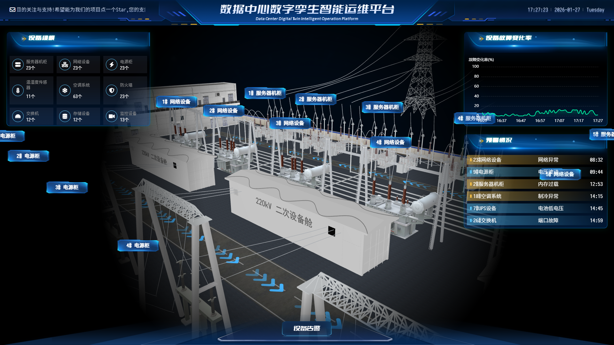

# 🚀 TwinOps - 数据中心数字孪生智能运维平台

> 国家电网设备监控与预测系统

> 一个基于数字孪生技术的智能运维平台，专注于国家电网设备监控，并引入大模型进行设备状态预测和故障分析。

<h1 align="center">
  
</h1>

## 📋 项目概述

TwinOps 是一个专为国家电网数据中心设计的数字孪生智能运维平台，通过 3D 可视化技术实现设备的实时监控、故障预警和智能预测。

## ✨ 核心功能

### 🎯 实时监控
- **设备状态实时可视化**：通过 3D 数字孪生模型实时展示设备运行状态
- **多维度数据采集**：监控设备温度、电压、电流、功率等关键参数
- **异常状态告警**：智能识别设备异常，及时发出告警通知

### 🔍 智能预测
- **设备故障预测**：利用大模型分析设备历史数据，预测潜在故障
- **性能趋势分析**：基于机器学习算法分析设备性能趋势
- **预测性维护**：提前识别设备维护需求，优化运维策略

### 📊 数据分析
- **实时数据图表**：展示设备运行数据的趋势和变化
- **故障统计分析**：分析设备故障类型和频率
- **运维效率评估**：评估运维策略的效果和改进空间

### 🎮 交互控制
- **3D 场景导航**：支持场景缩放、旋转、平移
- **设备定位**：快速定位特定设备位置

## 🛠 技术栈

- **前端框架**：Vue 3 + TypeScript
- **构建工具**：Vite 7.3.1
- **3D 可视化**：Three.js
- **图表库**：ECharts
- **动画库**：Tween.js、GSAP
- **数据处理**：Lodash
- **响应式适配**：Autofit.js
- **样式预处理**：SASS
- **HTTP 客户端**：Axios
- **事件总线**：Mitt

## 📦 快速开始

### 环境要求
- Node.js 20+
- npm 9+

### 安装依赖
```bash
npm install
```

### 启动开发服务器
```bash
npm run dev
```

### 生产构建
```bash
npm run build
```

### 预览生产版本
```bash
npm run preview
```

## 🏗️ 项目结构

```
TwinOps/
├─ docs/                # 生产构建输出目录
├─ public/              # 静态资源目录
├─ src/                 # 源代码目录
│  ├─ assets/          # 图片、样式等资源
│  ├─ components/      # Vue 组件（12个）
│  │  ├─ AlarmDeviceList.vue       # 告警设备列表弹窗
│  │  ├─ DeviceDetailPanel.vue     # 设备详情面板
│  │  ├─ LayoutFooter.vue          # 底部布局
│  │  ├─ LayoutHeader.vue          # 顶部布局
│  │  ├─ LayoutLoading.vue         # 加载组件
│  │  ├─ LayoutPanel.vue           # 布局面板
│  │  ├─ WidgetLabel.vue           # 标签组件
│  │  ├─ WidgetPanel01.vue         # 监控面板1
│  │  ├─ WidgetPanel02.vue         # 监控面板2
│  │  ├─ WidgetPanel03.vue         # 监控面板3
│  │  ├─ WidgetPanel04.vue         # 监控面板4
│  │  ├─ WidgetPanel05.vue         # 监控面板5
│  │  └─ WidgetPanel06.vue         # 监控面板6
│  ├─ hooks/           # 自定义 Hooks
│  │  ├─ useDataCenter.ts          # 数据中心状态管理
│  │  ├─ useEcharts.ts             # ECharts 图表管理
│  │  └─ useThree.ts               # Three.js 3D 场景管理
│  ├─ utils/           # 工具函数
│  │  └─ eventBus.ts               # 事件总线
│  ├─ App.vue          # 根组件
│  └─ main.ts          # 应用入口
├─ screenshots/        # 项目截图
├─ package.json        # 项目依赖配置
├─ vite.config.ts      # Vite 配置
└─ tsconfig.json       # TypeScript 配置
```

## 🎨 界面优化

### 布局优化
- **响应式设计**：左侧看板区域与右侧3D视图区域比例协调
- **空间利用**：所有功能面板集中在左侧，3D视图占据主要视觉空间
- **视觉层次**：通过阴影和边框区分不同功能区域

### 配色方案
- **主色调**：深蓝紫色渐变背景，营造科技感
- **面板风格**：半透明玻璃态效果，配合蓝色边框和图标
- **文字配色**：浅色调文字，确保在深色背景下的可读性
- **交互反馈**：悬停和点击效果采用蓝色系渐变，增强用户体验

### 视觉元素
- **渐变背景**：从深蓝到紫色的渐变，提供层次感
- **半透明效果**：面板使用半透明背景，突出3D视图
- **阴影效果**：使用柔和阴影增强立体感
- **平滑动画**：所有交互元素都有平滑的过渡动画

## 🎯 核心功能实现

### 1. 数据中心 3D 可视化
- 使用 Three.js 创建真实的 3D 数据中心场景
- 实时渲染服务器机架、设备和环境
- 支持场景导航、缩放、旋转等交互

### 2. 设备状态监控
- 实时显示设备运行参数（温度、湿度、电压、电流、功率）
- CPU、内存、磁盘、网络流量监控
- 设备状态（正常/警告/故障）可视化

### 3. 告警系统
- 设备异常自动检测
- 告警信息分级显示（一般/中等/严重）
- 告警设备列表弹窗

### 4. 数据可视化
- 使用 ECharts 绘制实时数据图表
- 支持多维度数据展示
- 图表数据自动更新

### 5. 响应式设计
- 适配不同屏幕尺寸
- 支持全屏和窗口模式
- 响应式布局调整

## 🚀 使用说明

### 开发环境
```bash
# 安装依赖
npm install

# 启动开发服务器（端口 8090）
npm run dev

# 访问应用
http://localhost:8090
```

### 生产构建
```bash
# 运行 TypeScript 类型检查
npm run type-check

# 生产构建（输出到 docs/ 目录）
npm run build

# 预览生产版本
npm run preview
```

### 代码质量
```bash
# 运行 ESLint 检查并自动修复
npm run lint

# 运行 Prettier 格式化代码
npm run format

# 运行 Stylelint 检查样式
npm run lint:style
```

## 📄 许可证
MIT License
